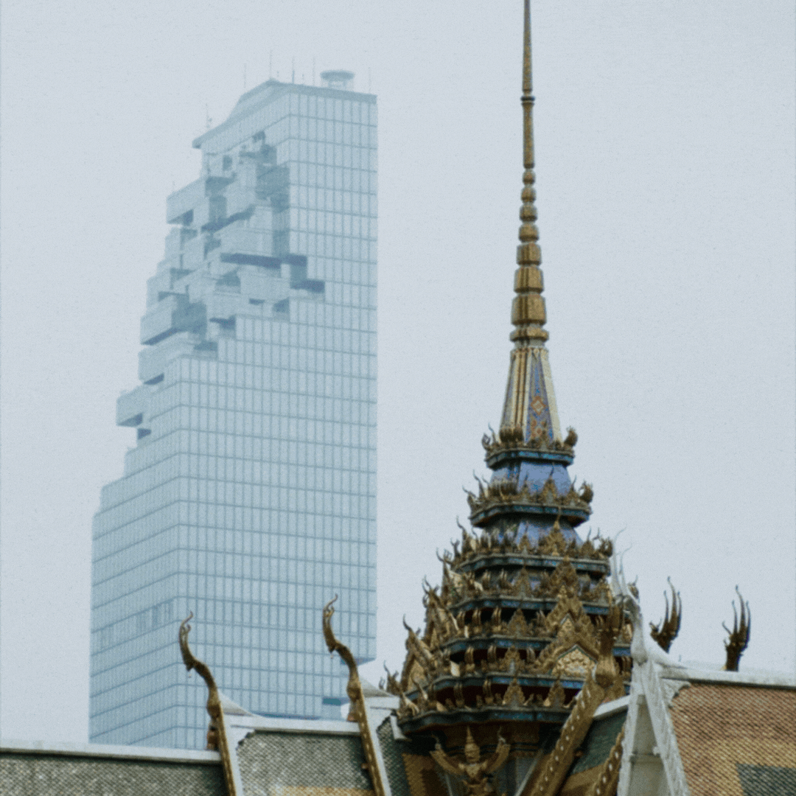

# Machine Learning Experiment

This repository contains my experiments in learning machine learning.

 

 
Above is a depth map generated using OpenVINO Monodepth from an image taken by me.

## List

### Core

- Hands on ML : Along with reading the book "Hands-On Machine Learning with Scikit-Learn, Keras, and TensorFlow".
- Transformer : Try transformer from scratch in Pytorch.

### NLP

- RAG : A simple POC for Retreival Augmented Generation.

### Computer Vision

### MLOps pipeline
